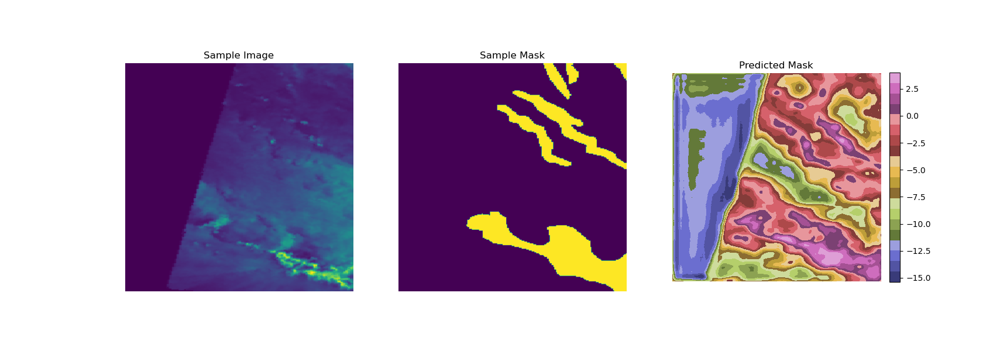

# CANDY Diffusion Segmentation

Diffusion-based segmentation model combining a **CANDY** (Causal Attractor Network with Dynamic Yield) forward encoder chain with a shared timestep-conditioned U-Net decoder.



---

## Architecture

```
Input x
  │
  ├─ CANDY_0 ──► origin[0]
  ├─ CANDY_1 ──► origin[1]      ← T independent CANDY encoders (~315K each)
  ·
  └─ CANDY_{T-1} ──► origin[T-1]
        │ feat
        ▼
  ◄── reverse t = T-1 .. 0 ──────────────────────────────────────────────
  │   fusion_conv_t( cat[feat, origin[t]] )
  │   + graph_schedule weighted skip
  │   → shared UNet( reverse_input, timestep_emb(t) )
  │     └─ multi-scale t-conditioning: bottleneck + up1 ~ up4
  ▼
seg_head  →  [B, num_classes, H, W]  logits
```

**Parameter budget (T=2, default):**

| Module          | Count | Params  |
|-----------------|-------|---------|
| CANDY encoders  | T=2   | ~0.6 M  |
| Shared UNet     | 1     | ~31.1 M |
| fusion\_convs   | T=2   | < 1 K   |
| seg\_head       | 1     | < 1 K   |
| **Total**       |       | **~31.7 M** |

Naïve T independent UNets: T × 31 M = **62 M** (T=2) / **155 M** (T=5).

---

## Environment

```bash
pip install torch torchvision monai transformers timm rasterio scikit-learn tqdm
```

---

## Dataset

Single-channel SAR images (`.tif`, 252 × 252, binary segmentation).

```
project/
├── cropped_images/              # clean images
├── cropped_masks/               # binary masks (0 / 1)
└── cropped_noised_data/
    ├── cropped_noised_0dB/
    ├── cropped_noised_10dB/
    └── cropped_noised_20dB/
```

**Split strategy (no data leakage):**

```
All N samples
├── Held-out test set : last 15%   (fixed across ALL models and folds)
└── Train + Val       : first 85%
    ├── Fold 0 : ~63.75% train  /  ~21.25% val
    ├── Fold 1 : ~63.75% train  /  ~21.25% val
    ├── Fold 2 : ~63.75% train  /  ~21.25% val
    └── Fold 3 : ~63.75% train  /  ~21.25% val
```

---

## Experimental Configuration

| Hyperparameter   | Value                        |
|------------------|------------------------------|
| Batch size       | 64                           |
| Epochs           | 11                           |
| Optimizer        | Adam                         |
| Learning rate    | 5 × 10⁻⁴                    |
| LR schedule      | OneCycleLR (10% warmup)      |
| Loss             | DiceLoss (sigmoid)           |
| Cross-validation | 4-fold                       |
| Input size       | 252 × 252                    |
| Diffusion steps  | T = 2 (default)              |
| Graph schedule   | linspace(0.7 → 0.2)         |

---

## Quick Start

**Train one model (4-fold CV):**
```bash
python main.py baseline -e 11 -k 4
```

**Test on clean held-out set:**
```bash
python test.py baseline -k 4 -f <best_fold>
```

**Test on noisy data (config-driven, no code change):**
```bash
python test.py baseline_0dB  -k 4 -f <best_fold>
python test.py baseline_10dB -k 4 -f <best_fold>
python test.py baseline_20dB -k 4 -f <best_fold>
```

**Run full pipeline (train → clean test → noise test):**
```bash
python run_all.py
```

Results and checkpoints are saved to `imgs/` and `checkpoint/` respectively.
Log is written to `log.txt`.

---

## Model Comparison

All models trained with identical hyperparameters; evaluated on the **same held-out 15% test set**.

| Model | Forward process | Decoder | Params | IoU ↑ | Dice ↑ |
|-------|-----------------|---------|--------|-------|--------|
| **CANDY Diffusion (ours)** | CANDY chain (learned) | Shared UNet + timestep emb | ~31.7 M | — | — |
| DDPM baseline | Gaussian noise schedule | Shared UNet + timestep emb | ~31.7 M | — | — |
| SegFormer-B0 | CANDY chain | MiT-B0 + All-MLP head | ~3.8 M | — | — |
| MobileViT-S | CANDY chain | MobileViT backbone | ~5.6 M | — | — |

---

## Ablation Study

All ablations share the same CANDY Diffusion framework (T=2) unless noted.

| Variant | Change vs. Baseline | IoU ↑ | Dice ↑ |
|---------|---------------------|-------|--------|
| **baseline** | Full model | — | — |
| no\_skip | No skip connections / fusion in reverse | — | — |
| simple\_cnn | CANDY → double-conv | — | — |
| simple\_decoder | UNet → 1×1 conv | — | — |
| sde | Gaussian noise (σ=0.1) in forward pass | — | — |
| adjust\_steps (T=5) | 5 diffusion steps | — | — |

---

## Noise Robustness

Best-fold checkpoint per model evaluated on Gamma-noise SAR data.

| Model | Clean | 20 dB | 10 dB | 0 dB |
|-------|-------|-------|-------|------|
| CANDY Diffusion | — | — | — | — |
| SegFormer-B0 | — | — | — | — |
| MobileViT-S | — | — | — | — |

---

## Repository Structure

```
├── config.py            # all hyperparams & ablation registry
├── main.py              # training entry point
├── test.py              # independent test script
├── run_all.py           # full pipeline runner
├── data_loading.py      # dataset & k-fold split logic
├── train.py             # train / val loops
├── utils.py             # visualisation & metrics
├── noise.py             # noisy dataset generation
└── models/
    ├── diffusion.py     # DiffusionModel (main)
    ├── candy.py         # CANDY encoder
    ├── unet.py          # UNet with timestep embedding
    ├── segformer_b0.py  # SegFormer-B0 decoder
    ├── mobilevit_small.py
    └── models.py        # ablation model factory
```
